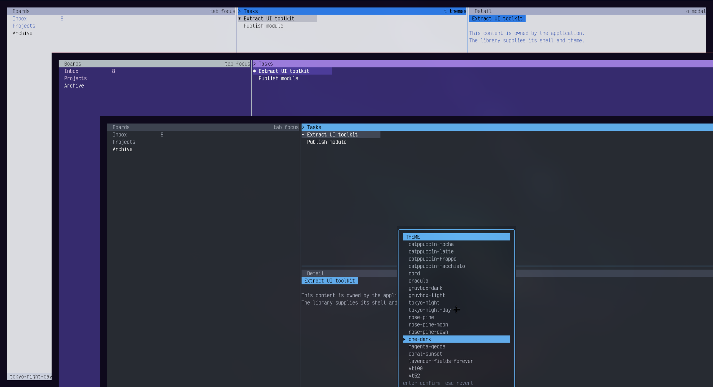

# tideui

`tideui` is a reusable Bubble Tea/Lipgloss presentation toolkit based on the
themeable terminal interface originally built for
[Tide](https://github.com/allisonhere/tide) and later refined in TideMail. It
renders application-provided content inside themed pane shells, status bars,
and overlays.

The package is intentionally view-oriented. Applications retain ownership of
their Bubble Tea model, commands, key routing, persistence, and viewport state;
the optional picker handles its own navigation once an application opens it.

## Lineage

The three-pane layout, theme preview workflow, and themed modal language began
in [Tide](https://github.com/allisonhere/tide), a terminal RSS reader. TideMail
later adapted and refined that interface; `tideui` packages the reusable UI
primitives for use in additional Bubble Tea applications.



## Install

```bash
go get github.com/allisonhere/tideui
```

## Features

- Nineteen built-in palettes with optional background, foreground, and accent overrides.
- Five layout modes: `StackedRight`, `ThreeColumn`, `SidebarOnly`, `Tabbed`, and `Floating`.
- Per-pane scroll offsets with a `PaneScroller` helper for managing scroll state.
- Single-line `Row` and multi-line `Block` primitives for rendering themed list content.
- Compact and comfortable density modes plus VT52 ASCII presentation.
- Themed pane headers, rows, status bars, overlays, and a Tide-derived theme picker.
- Terminal background sequences exposed for application-controlled terminal updates.
- Output constrained to the requested terminal dimensions, including very small windows.

## Usage

```go
import "github.com/allisonhere/tideui"

theme, _ := tideui.ThemeByName("catppuccin-mocha")
renderer := tideui.NewRenderer(theme, tideui.StyleOptions{Density: tideui.Compact})

view := renderer.Render(tideui.Layout{
    Width: 80, Height: 24, Mode: tideui.StackedRight,
    Panes: [3]tideui.Pane{
        {Title: "Projects", Content: "inbox\narchive", Focused: true},
        {Title: "Tasks",    Content: "ship tideui"},
        {Title: "Detail",   Content: "Application-owned content."},
    },
    Status: &tideui.StatusBar{Left: "ready", Right: "? help"},
})
```

## Bubble Tea Integration

Store terminal dimensions from `tea.WindowSizeMsg`, keep your application state
in your own model, and construct the renderer from the currently selected theme:

```go
func (m model) Update(msg tea.Msg) (tea.Model, tea.Cmd) {
    if size, ok := msg.(tea.WindowSizeMsg); ok {
        m.width, m.height = size.Width, size.Height
    }
    return m, nil
}

func (m model) View() string {
    renderer := tideui.NewRenderer(m.theme, tideui.StyleOptions{Density: m.density})
    return renderer.Render(tideui.Layout{
        Width: m.width, Height: m.height, Mode: tideui.ThreeColumn,
        Panes: m.panes(),
    })
}
```

## Layouts

| Mode | Description | Configuration fields |
|---|---|---|
| `StackedRight` | Pane 0 as sidebar, panes 1 and 2 stacked on the right | `SidebarRatio`, `UpperRightRatio` |
| `ThreeColumn` | All three panes side by side | `ColumnRatios` |
| `SidebarOnly` | Pane 0 as sidebar, pane 1 as full-height main area (pane 2 unused) | `SidebarRatio` |
| `Tabbed` | Tab bar across the top; the focused pane's content fills the area below | — |
| `Floating` | Pane 0 as full-screen background; panes 1 and 2 as overlaid floating panels | `FloatWidthRatio`, `FloatHeightRatio` |

```go
// StackedRight with custom ratios
layout.Mode = tideui.StackedRight
layout.SidebarRatio    = 0.30
layout.UpperRightRatio = 0.45

// ThreeColumn with relative widths
layout.Mode         = tideui.ThreeColumn
layout.ColumnRatios = [3]float64{2, 3, 5}

// Floating panels
layout.Mode             = tideui.Floating
layout.FloatWidthRatio  = 0.40   // panels occupy 40 % of width
layout.FloatHeightRatio = 0.50   // split evenly between the two panels
```

In `Tabbed` mode the `Focused` field on each `Pane` selects the active tab
(first focused pane wins; falls back to pane 0).

## Rows and Blocks

### Single-line rows

`RenderRow` renders a single-line list item with optional prefix and
right-aligned suffix. Use the `Selected` and `Muted` states for highlighting:

```go
rows := []string{
    renderer.RenderRow(tideui.Row{Prefix: "* ", Text: "Selected", Suffix: "3", Selected: true}, 26),
    renderer.RenderRow(tideui.Row{Prefix: "  ", Text: "Normal"}, 26),
    renderer.RenderRow(tideui.Row{Prefix: "  ", Text: "Archived", Muted: true}, 26),
}
```

### Multi-line blocks

`RenderBlock` renders a structured item with a header line and an optional
multi-line body — useful for message threads, notification cards, or any content
richer than a single row. A `Block` with no `Body` produces byte-identical
output to the equivalent `RenderRow`.

```go
blocks := []string{
    renderer.RenderBlock(tideui.Block{
        Prefix: "● ", Header: "alice", Meta: "10:02",
        Body: "The UI toolkit is looking great.",
    }, width),
    renderer.RenderBlock(tideui.Block{
        Prefix: "● ", Header: "bob", Meta: "10:05",
        Body:     "Agreed — just added multi-line block support.",
        Selected: true,
    }, width),
    renderer.RenderBlock(tideui.Block{
        Prefix: "○ ", Header: "alice", Meta: "10:07",
        Body:  "Does it support scrolling?",
        Muted: true,
    }, width),
}
```

The `Body` is indented to align with the header text start (after `Prefix`).
`Selected` and `Muted` apply to the header line; the body always uses
`DetailBody` styling.

### Custom detail content

Use the exported `Styles` for completely custom content inside a pane:

```go
detail := renderer.Styles.DetailTitle.Render("Subject line") + "\n" +
    renderer.Styles.DetailMeta.Render("alice · 10:02") + "\n\n" +
    renderer.Styles.DetailBody.Render("Message body text goes here.")
```

Focused panes use the theme accent. Set `Pane.Accent` only when an individual
pane should intentionally override the accent color.

## Scrollable Panes

Set `Pane.ScrollOffset` to scroll a pane's content by that many lines.
`PaneScroller` is a convenience helper that manages the integer offset and
exposes scroll actions:

```go
type model struct {
    scrollers [3]tideui.PaneScroller
    // ...
}

// In Update:
case "j", "down":
    m.scrollers[m.focus].ScrollDown(1)
case "k", "up":
    m.scrollers[m.focus].ScrollUp(1)
case "g":
    m.scrollers[m.focus].ScrollToTop()

// In View — pass Offset() to each pane:
tideui.Pane{
    Title:        "Tasks",
    Content:      strings.Join(rows, "\n"),
    Focused:      m.focus == 1,
    ScrollOffset: m.scrollers[1].Offset(),
}
```

`ClampTo(totalLines, visibleLines)` prevents the scroller from going past the
last line when you know the content line count. The renderer silently clamps
out-of-range offsets regardless, so a blank pane is never produced.

`CanScrollDown(totalLines, visibleLines)` reports whether more content is
hidden below, which is useful for rendering a scroll indicator.

## Themes

Choose from `BuiltinThemes`, resolve a saved name with `ThemeByName`, or adjust
a built-in theme through `ThemeOverrides`:

```go
renderer := tideui.NewRenderer(tideui.VT100, tideui.StyleOptions{
    Density: tideui.Compact,
    Overrides: tideui.ThemeOverrides{
        Background: "#080b08",
        Foreground: "#8cff8c",
        Accent:     "#33ff33",
    },
})
```

Built-in theme names:

`catppuccin-mocha`, `catppuccin-latte`, `catppuccin-frappe`,
`catppuccin-macchiato`, `nord`, `dracula`, `gruvbox-dark`, `gruvbox-light`,
`tokyo-night`, `tokyo-night-day`, `rose-pine`, `rose-pine-moon`,
`rose-pine-dawn`, `one-dark`, `magenta-geode`, `coral-sunset`,
`lavender-fields-forever`, `vt100`, and `vt52`.

## Theme Picker

`ThemePicker` provides Tide-derived picker state and modal rendering:
`j`/`k` and arrow keys preview themes, `enter` confirms, and `esc` reverts.
Your application still decides when to open it, persists confirmed selections,
and emits terminal background sequences.

```go
type model struct {
    width, height int
    theme         tideui.Theme
    picker        tideui.ThemePicker
}

func newModel(savedName string) model {
    theme, _ := tideui.ThemeByName(savedName)
    return model{
        theme:  theme,
        picker: tideui.NewThemePicker(tideui.ThemePickerOptions{InitialTheme: theme.Name}),
    }
}

func (m model) Update(msg tea.Msg) (tea.Model, tea.Cmd) {
    if key, ok := msg.(tea.KeyMsg); ok {
        if key.String() == "t" && !m.picker.Opened() {
            m.picker.Open(m.theme.Name)
        } else if m.picker.Opened() {
            action := m.picker.Update(key)
            m.theme = m.picker.PreviewTheme() // rebuild View immediately for live preview
            if action == tideui.ThemePickerConfirm {
                saveThemeName(m.picker.ConfirmedTheme().Name)
            }
        }
    }
    return m, nil
}

func (m model) View() string {
    renderer := tideui.NewRenderer(m.theme, tideui.StyleOptions{})
    layout := tideui.Layout{Width: m.width, Height: m.height, Panes: m.panes()}
    if m.picker.Opened() {
        modal := m.picker.Modal(renderer, 40, m.height)
        layout.Modal = &modal
    }
    return renderer.Render(layout)
}
```

## Status Bars and Overlays

Provide a `StatusBar` and optional `Overlay` in the layout; `Width` on an
overlay is the full modal width including its border:

```go
layout.Status = &tideui.StatusBar{Left: "ready", Right: "? help"}
layout.Modal = &tideui.Overlay{
    Visible: showHelp,
    Title:   "HELP",
    Content: "j/k move\nenter select",
    Footer:  "esc close",
    Width:   36,
}
```

## Terminal Background

`TerminalBackgroundSequences` returns OSC sequences for terminals that support
changing their default background color. It does not write to stdout or the
terminal; the application decides whether and where to emit the strings.

## API Boundaries

In v1, `tideui` renders presentation primitives. The consuming application owns:

- Bubble Tea `Update` behavior and commands.
- Application keyboard navigation and focus state outside the theme picker.
- Scroll offset state (via `PaneScroller` or directly via `Pane.ScrollOffset`).
- Content formatting and line counts for `ClampTo` / `CanScrollDown`.
- Persisted theme configuration after picker confirmation.
- Terminal control sequence output.

## Requirements

The module currently targets Go 1.26 or newer and uses Bubble Tea and Lipgloss.

## Development

```bash
go test ./...
go vet ./...
```

Run the demo with `go run ./cmd/demo`.

| Key | Action |
|---|---|
| `tab` / `shift+tab` | Move focus between panes |
| `j` / `k` | Scroll the focused pane |
| `g` | Scroll to top |
| `l` | Cycle layout modes |
| `t` | Open theme picker |
| `d` | Toggle density |
| `o` | Toggle overlay |
| `q` | Quit |
