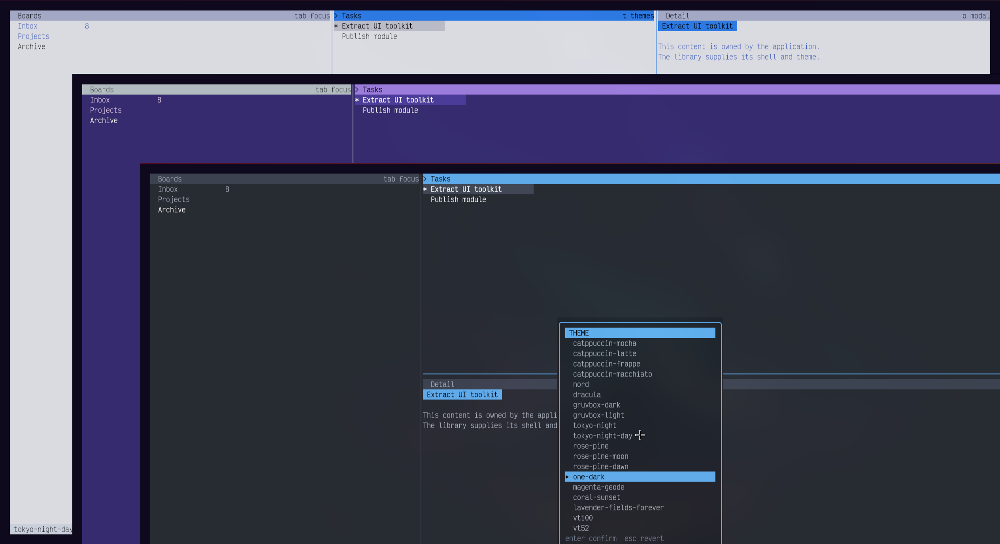

# tideui

**A themeable, multi-pane terminal UI toolkit for [Bubble Tea](https://github.com/charmbracelet/bubbletea) and [Lipgloss](https://github.com/charmbracelet/lipgloss).**

`tideui` renders application-provided content inside themed pane shells, status
bars, and overlays. It is deliberately *view-oriented*: your application keeps
its own Bubble Tea model, key routing, persistence, and viewport state — you
hand `tideui` strings and dimensions, and it returns a framed, themed view.



## Lineage

The three-pane layout, theme-preview workflow, and themed modal language began
in [Tide](https://github.com/allisonhere/tide), a terminal RSS reader, and were
refined in [TideMail](https://github.com/allisonhere/tidemail), a keyboard-first
email client. `tideui` packages those reusable primitives for any Bubble Tea
application.

## Install

```bash
go get github.com/allisonhere/tideui
```

## Features

- **Five layout modes** — `StackedRight`, `ThreeColumn`, `SidebarOnly`, `Tabbed`, and `Floating`, each with tunable ratios.
- **Nineteen built-in palettes** (Catppuccin, Nord, Dracula, Gruvbox, and more) with per-field background/foreground/accent overrides.
- **Themed chrome** — pane headers, status bars, centered modal overlays, and a ready-made theme picker.
- **Soft modal panels** — Tide-family modal chrome with embedded border titles, quiet hint footers, and rail-focused rows.
- **Full-border pane focus** — every pane renders a 4-sided border colored by focus state, contrast-boosted to a 7:1 floor (square or round corners) so the focused pane is never hard to spot.
- **List primitives** — single-line `Row` and multi-line `Block` with selected/muted states.
- **Per-pane scrolling** via `Pane.ScrollOffset` and the `PaneScroller` helper.
- **Resizable panes** via the `PaneRatio` helper, for shift+arrow-style ratio adjustment.
- **Density + accessibility** — compact/comfortable spacing and a VT52 ASCII mode.
- **Bounded output** — never exceeds the requested terminal dimensions, down to tiny windows.
- **Terminal background control** — exposes the escape sequences so the app, not the library, writes to the terminal.

## Quick start

```go
import "github.com/allisonhere/tideui"

theme, _ := tideui.ThemeByName("catppuccin-mocha")
renderer := tideui.NewRenderer(theme, tideui.StyleOptions{Density: tideui.Compact})

view := renderer.Render(tideui.Layout{
    Width: 80, Height: 24, Mode: tideui.StackedRight,
    Panes: [3]tideui.Pane{
        {Title: "Sidebar", Content: "Item one\nItem two", Focused: true},
        {Title: "List",    Content: "Welcome to tideui"},
        {Title: "Preview", Content: "Application-owned content."},
    },
    Status: &tideui.StatusBar{Left: "ready", Right: "? help"},
})
```

## Bubble Tea integration

`tideui` owns no model state. Track dimensions and theme in your own model and
build a renderer in `View`:

```go
func (m model) Update(msg tea.Msg) (tea.Model, tea.Cmd) {
    if size, ok := msg.(tea.WindowSizeMsg); ok {
        m.width, m.height = size.Width, size.Height
    }
    return m, nil
}

func (m model) View() string {
    r := tideui.NewRenderer(m.theme, tideui.StyleOptions{Density: m.density})
    return r.Render(tideui.Layout{
        Width: m.width, Height: m.height, Mode: tideui.ThreeColumn,
        Panes: m.panes(),
    })
}
```

## Layout modes

| Mode | Description | Ratio fields |
|---|---|---|
| `StackedRight` | Pane 0 sidebar; panes 1 & 2 stacked on the right | `SidebarRatio`, `UpperRightRatio` |
| `ThreeColumn` | All three panes side by side | `ColumnRatios` |
| `SidebarOnly` | Pane 0 sidebar; pane 1 full-height main (pane 2 unused) | `SidebarRatio` |
| `Tabbed` | Tab bar on top; the focused pane fills the area below | — |
| `Floating` | Pane 0 as background; panes 1 & 2 as floating panels | `FloatWidthRatio`, `FloatHeightRatio` |

```go
layout.Mode = tideui.StackedRight
layout.SidebarRatio, layout.UpperRightRatio = 0.30, 0.45

layout.Mode, layout.ColumnRatios = tideui.ThreeColumn, [3]float64{2, 3, 5}
```

In `Tabbed` mode the first `Focused` pane selects the active tab (falling back to
pane 0). All ratio fields default to sensible values when left zero.

## Theming

```go
theme, ok := tideui.ThemeByName("nord")   // false if unknown
for _, t := range tideui.BuiltinThemes { /* ... */ }
```

Override individual colors without forking a palette:

```go
theme = tideui.ThemeOverrides{
    Accent: "#f5c2e7",
}.Apply(tideui.CatppuccinMocha)
```

`Theme.UsesASCII()` reports VT52 mode (ASCII-only glyphs) so callers can adapt.
`StyleOptions{Density: tideui.Comfortable}` adds spacing; `Compact` removes it.

## Pane borders

Every pane renders a full 4-sided border, colored by theme `Border` when
idle and `BorderFocus` (or `Pane.Accent`, if set) when focused. The focused
color is nudged to clear a 7:1 contrast floor against the theme background,
and the selected-row background (`Styles.ItemSelected`) is nudged to a 3:1
floor — both walk up in lightness steps rather than relying on a fixed
delta, so neither goes unnoticeable on unusually light or dark themes.

Corners default to square; opt into rounded corners per-renderer:

```go
tideui.NewRenderer(theme, tideui.StyleOptions{PaneCorners: tideui.RoundCorners})
```

## Rows and blocks

`RenderRow` draws a single-line list item; `RenderBlock` adds an optional
multi-line body (a `Block` with no `Body` is byte-identical to the matching
`Row`). Both support `Selected` and `Muted`:

```go
renderer.RenderRow(tideui.Row{Prefix: "* ", Text: "Item", Suffix: "12", Selected: true}, width)

renderer.RenderBlock(tideui.Block{
    Prefix: "● ", Header: "alice", Meta: "10:02",
    Body:   "Multi-line body, indented to the header.",
}, width)
```

For fully custom pane content, use the exported `renderer.Styles` (e.g.
`DetailTitle`, `DetailMeta`, `DetailBody`).

## Scrollable panes

Set `Pane.ScrollOffset`, or let `PaneScroller` manage it:

```go
m.scroll.ScrollDown(1)            // ScrollUp / ScrollToTop also available
m.scroll.ClampTo(total, visible)  // optional; renderer clamps out-of-range anyway

pane.ScrollOffset = m.scroll.Offset()
```

`CanScrollDown(total, visible)` reports whether more content lies below.

## Resizable panes

`tideui` still leaves key routing to the application, but `PaneRatio` owns
the bounds and step math for an adjustable split — wire it to your own
shift+arrow (or any other) key handling:

```go
m.sidebarRatio = tideui.NewPaneRatio(tideui.PaneRatioOptions{
    Initial: 0.30, Min: 0.15, Max: 0.5, Step: 0.02,
})

// in Update, on your app's own resize keys:
m.sidebarRatio.Shrink() // e.g. shift+left
m.sidebarRatio.Grow()   // e.g. shift+right

// in View:
layout.SidebarRatio = m.sidebarRatio.Value()
```

Hold one `PaneRatio` per adjustable split — `SidebarRatio`, `UpperRightRatio`,
a `ColumnRatios` entry, or a `Floating` ratio all work the same way.

## Theme picker

A drop-in modal for previewing and confirming themes:

```go
picker := tideui.NewThemePicker(tideui.ThemePickerOptions{InitialTheme: "nord"})
picker.Open("nord")

switch picker.Update(keyMsg) {
case tideui.ThemePickerConfirm:
    m.theme = picker.ConfirmedTheme()
case tideui.ThemePickerCancel:
    // preview reverted to the confirmed theme
}

overlay := picker.Modal(renderer, m.width, m.height) // assign to Layout.Modal
```

The picker previews live as you navigate and restores the confirmed theme on
cancel.

Use the soft-panel variant for the newer Tide-family modal style:

```go
overlay := picker.SoftModal(renderer, 42, m.height, "tidedock")
```

## Soft panels

Soft panels render the newer Tide-family modal chrome with the app prefix and
title embedded in the top border:

```go
content := renderer.Styles.OverlayBody.Width(36).Render("Ready")
overlay := renderer.SoftPanelOverlay(tideui.SoftPanel{
    Prefix: "tidedock",
    Title: "status",
    Content: content,
    Width: 40,
})
layout.Modal = &overlay
```

Use `RenderSoftRow` for command palettes and picker rows, and
`RenderSoftHints` for quiet lowercase footer hints.

## Terminal background

`tideui` never writes to the terminal itself. To paint the terminal background
to match the theme, fetch the sequences and emit them from your program:

```go
set, reset := tideui.TerminalBackgroundSequences(theme)
```

## Design

Applications retain ownership of their model, commands, key routing,
persistence, and viewport state. `tideui` is purely presentational — it turns
content + dimensions + a theme into a bounded, framed string. The one exception
is the optional `ThemePicker`, which manages its own navigation once opened.

## License

MIT.
